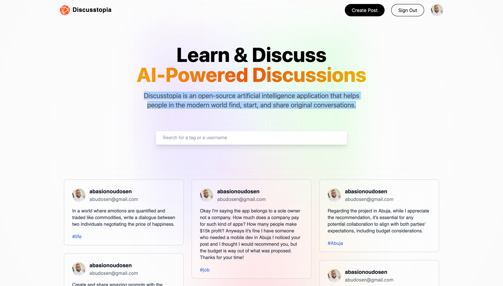
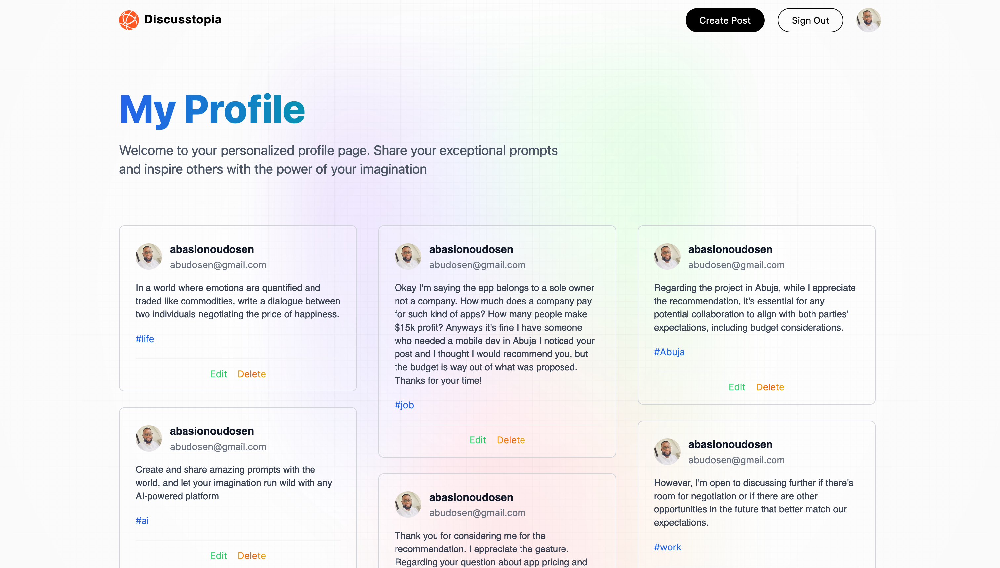
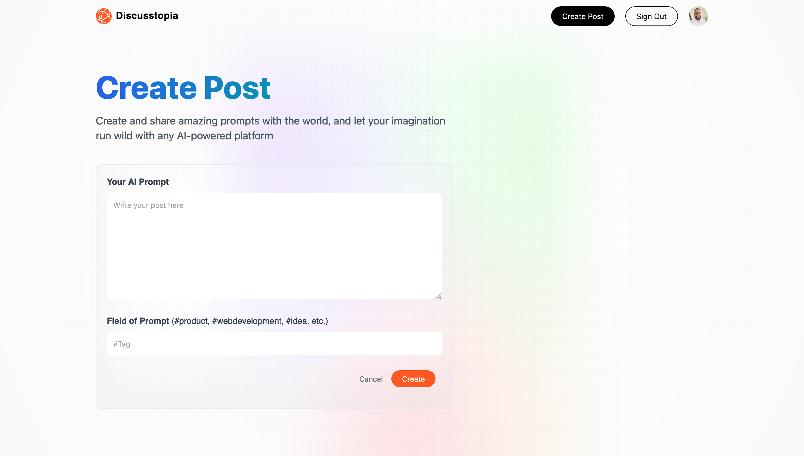

# NextJs - Discusstopia Web App

Discusstopia is an open-source artificial intelligence application that helps people in the modern world find, start, and share original conversations.
This is a Next.js web application demonstrates CRUD (Create, Read, Update, Delete) operations with authentication using Google OAuth. The application also utilizes MongoDB Atlas as the database to store data.

## Features

- CRUD Operations: Perform Create, Read, Update, and Delete operations on data.
- Google Authentication: Users can sign in using their Google accounts.
- MongoDB Atlas Integration: Data is stored and retrieved from MongoDB Atlas, a cloud database service.
- Session Management: Users' sessions are managed securely.

### Screenshots

<div style="display: flex;">



</div>

## Configuration

- GOOGLE_ID=your_google_id
- GOOGLE_CLIENT_SECRET=your_google_client_secret
- MONGODB_URI=your_mongodb_uri

## Dependencies:

- [Next.js]: (https://nextjs.org/) Framework for building React applications with server-side rendering. Learn more
- [React]: (https://reactjs.org/) JavaScript library for building user interfaces. Learn more
- [MongoDBAtlas] (https://www.mongodb.com/cloud/atlas) Cloud-based database service by MongoDB. Learn more
- [Mongoose]: (https://mongoosejs.com/) MongoDB object modeling tool designed to work in an asynchronous environment. Learn more
- [NextAuth.js]: Authentication library for Next.js applications. Learn more
- [GoogleOAuthAPI]: (https://developers.google.com/identity/protocols/oauth2) Google's OAuth 2.0 authentication service. Learn more
- [dotenv]: (https://www.npmjs.com/package/dotenv) Loads environment variables from a .env file. Learn more

## Installation

```bash
1. git clone https://github.com/abazudosen/Discusstopia

2. cd your-project-directory

3. npm install

4. npm run dev

5. Open the Application: Visit http://localhost:3000 in your web browser to view the application.

```

## Usage

    Authentication: Click on the "Sign In with Google" button to authenticate using your Google account.
    CRUD Operations: Once authenticated, you can perform CRUD operations on the data.

## Contributing

Contributions are welcome! If you find any issues or have suggestions for improvements, feel free to open an issue or create a pull request.
License

This project is licensed under the MIT License.
